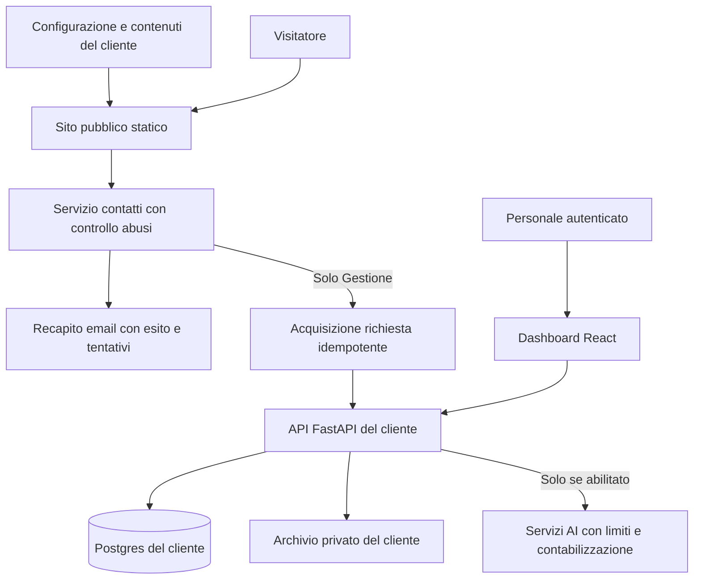

# Architettura e sviluppo dei due prodotti

Questo documento distingue il codice locale osservato dalla proposta futura. Nessuna migrazione di database, nuova infrastruttura o attivazione commerciale è stata eseguita nella preparazione del dossier.

## 1. Base osservata

| Evidenza locale | Cosa dimostra | Cosa non dimostra |
| --- | --- | --- |
| `frontend/package.json` | React 19, CRA/CRACO, Tailwind, React Query e componenti UI già presenti | Idoneità di ogni componente al nuovo prodotto |
| `backend/requirements.txt`, `backend/document_store.py` | FastAPI, Supabase e accesso Postgres | Isolamento fra tutti i ruoli e tenant collaudato |
| `frontend/src/brand/identity.js`, `TenantContext.jsx`, `template/brand.example.json` | Personalizzazione parziale di identità e tema | Tutte le diciture e i documenti configurabili senza residui GB |
| `frontend/src/App.js` | Routing pubblico, dashboard, Campo e portale cliente | Pacchetto Presenza separato e pronto |
| `template/README.md` | Procedura di replica da una versione stabile | Provisioning automatico o aggiornamenti uniformi già implementati |

La copia locale è sul branch `main`, con modifiche preesistenti. Il preview autenticato esaminato nell'audit era il deploy `develop`: non si presume identità fra le due versioni. Ogni release richiede commit identificato, build e verifica sull'ambiente destinato al cliente.

I riferimenti della tabella precedente descrivono il workspace locale analizzato su `main`, inclusi materiali locali non ancora tracciati. Non tutti questi file esistono su `develop`: il trasferimento delle ottimizzazioni pubbliche non costituisce migrazione del gestionale o del database della preview.

## 2. Decisioni proposte

**Codice comune e configurazioni per cliente**, evitando fork con correzioni divergenti. Una versione del prodotto alimenta più installazioni con manifest di configurazione e asset propri.

**Dati operativi separati per cliente nelle prime installazioni Gestione.** Progetti/database/storage dedicati, backend con credenziali del cliente e frontend configurato. Questo riduce la superficie da validare fra imprese, ma non elimina i controlli fra utenti della stessa impresa, gli errori di configurazione o il lavoro di aggiornamento. Il costo dedicato è incluso nell'ipotesi economica di Gestione.

**Presenza indipendente dal gestionale.** Hosting statico e servizio limitato al recapito del modulo; niente caricamento di moduli CRM, credenziali gestionali o dipendenza dal database dei cantieri per mostrare contenuti pubblici.

**AI disattivata nel perimetro standard.** Abilitazione esplicita, budget e consumo lato server dopo validazione dei costi e del flusso.

## 3. Architettura obiettivo



Per il futuro sito a pagine propongo **Astro con componenti React dove serve interattività**: pagine HTML generate alla build, contenuti e metadati per URL, sezioni interattive caricate in modo selettivo. Questa scelta serve a rendere Presenza autonomo e il portfolio consultabile anche senza attendere l'applicazione gestionale. Non è una migrazione eseguita sul sito GB in questa iterazione. La documentazione ufficiale descrive HTML statico e JavaScript limitato alle aree interattive: [Astro Islands](https://docs.astro.build/en/concepts/islands/).

La dashboard conserva React/FastAPI; non si cambia framework per correggere i bug attuali. Uno spike iniziale deve verificare il riuso di identità, componenti e asset senza importare il routing/auth della dashboard nel sito pubblico. Se il riuso richiede più lavoro del budget, rivedere la stima prima dell'implementazione estesa.

Struttura obiettivo, da introdurre gradualmente:

```text
apps/site/                 sito pubblico e pagine statiche
apps/dashboard/            interfaccia operativa React
backend/                   API, autorizzazioni e servizi
packages/brand/            schema configurazione e token
packages/ui/               componenti visivi effettivamente condivisi
clients/<slug>/            contenuti e asset pubblici, senza segreti
release/                   versioni, migrazioni e manifest installazioni
```

Non spostare tutto il repository in un singolo cambiamento: introdurre il sito separato, provarlo, poi estrarre soltanto il codice realmente comune.

## 4. Configurazione e abilitazione dei moduli

Manifest proposto (non è ancora un contratto API implementato):

```json
{
  "schemaVersion": 1,
  "customerSlug": "impresa-esempio",
  "product": "presenza",
  "profile": "impresa-edile",
  "publicOrigin": "https://www.esempio.it",
  "brand": { "name": "Impresa esempio", "logo": "/brand/logo.svg" },
  "content": { "services": [], "projects": [], "contacts": {} },
  "modules": { "crm": false, "computi": false, "campo": false, "ai": false }
}
```

Per Gestione configurare inoltre ruoli, listino, modelli documentali, numerazione, destinatari e quote. Segreti e token stanno nella configurazione protetta dell'ambiente, non nel JSON distribuito al browser.

Il browser riceve solo configurazione pubblica e capacità autorizzate. Il server verifica abilitazione del modulo, identità e ruolo a ogni operazione. Nascondere un menu non blocca una richiesta API. Un `tenant_id` o slug inviato dal browser non assegna diritti: il contesto operativo deve derivare dalla sessione e dalle appartenenze verificate.

## 5. Richieste dal sito e upgrade

**Presenza:** modulo → validazione/rate limit → registrazione minima dell'esito o coda affidabile → email al destinatario configurato. Il testo del visitatore non può scegliere il destinatario o impersonare il mittente. Gli allegati non sono necessari nel modulo standard. Gestire i fallimenti del provider e offrire un contatto alternativo senza mostrare un falso successo.

**Gestione:** stesso schema della richiesta → identificativo idempotente → creazione lead nel contesto del cliente → notifica. Ritentare una notifica non deve creare un secondo lead. Distinguere richiesta salvata da email consegnata.

**Upgrade:** predisporre istanza gestionale, utenti, moduli e mapping; verificare un contatto di prova; attivare la destinazione CRM dal server. Conservare URL pubblici, contenuti e dominio. Importare solo lo storico disponibile e concordato: l'archivio email non diventa automaticamente una banca dati CRM.

## 6. Ruoli proposti e prova dei permessi

| Ruolo | Accesso di principio |
| --- | --- |
| Titolare/amministratore | Configurazione, utenti, dati operativi e indicatori dell'impresa |
| Commerciale | Richieste, appuntamenti e preventivi consentiti; nessuna amministrazione utenti |
| Responsabile operativo | Cantieri/commesse assegnati, documenti e attività autorizzate |
| Collaboratore sul campo | Rilievi e misure dei lavori assegnati, senza quadro economico generale |
| Cliente invitato | Solo il proprio portale e gli elementi esplicitamente condivisi |

La matrice è una proposta da confrontare con i ruoli esistenti `admin`, `operations`, `staff` e con i requisiti del cliente. Non si dichiara che questi confini siano già applicati ovunque.

Collaudo obbligatorio: account distinti, API dirette con autorizzazione di test, letture/scritture negate, revoca dell'utente e delle sessioni, file privati, URL di accesso e assenza di dati di un altro cliente. Verificare anche cache, export e dati offline del dispositivo dopo logout/cambio account. Le policy RLS possono applicare restrizioni sulle righe, ma chiavi con privilegi elevati non vanno esposte e i percorsi backend privilegiati richiedono controlli propri: [Supabase RLS](https://supabase.com/docs/guides/database/postgres/row-level-security).

## 7. Documenti, backup e continuità

Un solo percorso di autenticazione operativa deve autorizzare coerentemente dashboard, foto e archivio. Il blocco «sessione Supabase richiesta» osservato nell'audit va risolto prima di includere gli allegati nella consegna.

Archivi privati, autorizzazione per documento e collegamenti temporanei dove necessari. Validare tipo/dimensione dei file, quote e stato del caricamento. Separare asset pubblici del sito da documenti di commessa e portale cliente.

Backup database e copia dei file sono procedure distinte: i backup del database Supabase non includono gli oggetti Storage, come precisa la [documentazione backup](https://supabase.com/docs/guides/platform/backups). Occorre provare il ripristino di entrambi, non limitarsi a vedere una voce attiva nel piano.

Obiettivi di progetto iniziali: perdita dati massima di 24 ore e ripristino entro un giorno lavorativo. Non sono SLA già disponibili: diventeranno impegni soltanto dopo verifica di backup, persone, volumi e prova cronometrata. Identificare responsabile, frequenza, conservazione, destinazione e accesso alle copie.

## 8. SEO, contenuti e prestazioni

Presenza deve generare titolo, descrizione, canonical e sitemap dal dominio del cliente. Pagina utile per ciascun servizio/progetto, dati aziendali coerenti, immagini dimensionate e alternative testuali. Nessuna pagina geografica duplicata solo cambiando il nome della città.

Prima di sostituire un sito: inventario URL effettivi, contenuti da conservare, redirect puntuali, verifica dei link. Non riattivare il dominio GB sospeso né configurare una migrazione in questa fase.

Distinguere ambiente pubblico e preview: protezione del preview e direttive di indicizzazione coerenti; le direttive non sostituiscono l'autenticazione delle aree private.

Budget di progetto proposti: JavaScript iniziale del sito vetrina entro 100 KB gzip, immagine principale mobile entro 250 KB, dimensioni riservate agli asset, nessun video obbligatorio prima del contatto. Sono obiettivi futuri, non misure del sito attuale. Per il gestionale resta un budget distinto. Misurare prestazioni su dispositivi e rete rappresentativi, poi dati reali quando il sito viene pubblicato.

## 9. Installazione e aggiornamenti

1. Versione stabile identificata e configurazione validata; nessuna replica da worktree sporco.
2. Account/risorse del cliente o dell'agenzia definiti nel contratto; dominio intestato secondo l'accordo.
3. Ambienti separati, segreti dedicati, account nominativi e nessun dato dimostrativo privato di GB.
4. Preview con contenuti del cliente, collaudo contatto e, per Gestione, un flusso completo.
5. Backup, migrazioni versionate e piano di ritorno alla versione precedente. Il rollback del frontend non annulla una migrazione incompatibile.
6. Pubblicazione concordata, controllo runtime e registro della versione per installazione.
7. Aggiornamenti progressivi: un ambiente pilota, poi gli altri clienti; stessa base di codice e verifica delle personalizzazioni.

Un backend condiviso fra imprese può essere valutato in seguito quando il costo misurato delle istanze e della manutenzione lo giustifica. Non è necessario per la prima vendita e non azzera i costi. Richiede isolamento dimostrato, procedure di export/ripristino per singolo cliente e monitoraggio delle quote.

## 10. Roadmap e criteri di accettazione

| Fase | Lavoro | Uscita verificabile |
| --- | --- | --- |
| 0 — sito GB locale | Correzioni del percorso e collaudo descritti nel rapporto | Build e test locali; release preview separata |
| 1 — Presenza, 32–56 h | Sito statico, schema contenuti, contatto autonomo, manifest | Due marchi demo, nessuna chiamata al gestionale necessaria per presentarsi, richiesta di prova recapitata |
| 2 — Gestione, 80–136 h | Documenti/auth, stati, riepiloghi, ruoli, calendario, flusso operativo | Dati coerenti da lead a SAL/economics; permessi negativi verificati |
| 3 — operatività, 40–64 h | Provisioning, release, backup, export, monitoraggio | Seconda installazione pulita, ripristino provato e aggiornamento comune |
| 4 — confezione commerciale, 16–24 h | Demo, manuali, schede e capitolati | Due offerte presentabili con confini e costi misurabili |
| Successiva — studi tecnici, 48–80 h indicative | Stati incarico, documenti e scadenze validati con studi | Due casi d'uso professionali completati senza adattamenti manuali fuori sistema |

Le stime riguardano lavoro tecnico/editoriale, non tempi calendario garantiti. Fase 2 può crescere se il collaudo rivela problemi nei dati o nelle autorizzazioni. Nessuna funzione non collaudata va elencata come pronta solo per rispettare una data commerciale.

## 11. Checklist di consegna

- Tutti i riferimenti al cliente precedente sostituiti in interfaccia, metadati, PDF, email e messaggi.
- Dominio, destinatari, marchio, listino e quote corretti; capacità del piano coerenti fra UI e server.
- Test desktop/mobile, tastiera, errori di rete e percorso di contatto riuscito su casella di prova.
- Per Gestione: dati campione coerenti, controllo versioni dei computi, misure e SAL, stati preventivi, movimenti economici e documenti.
- Nessun accesso a file/dati non autorizzati; utente revocato realmente escluso.
- Export e ripristino verificati; referente del cliente formato.
- Versione, ambiente, esiti e problemi residui registrati; produzione verificata dopo la pubblicazione.
